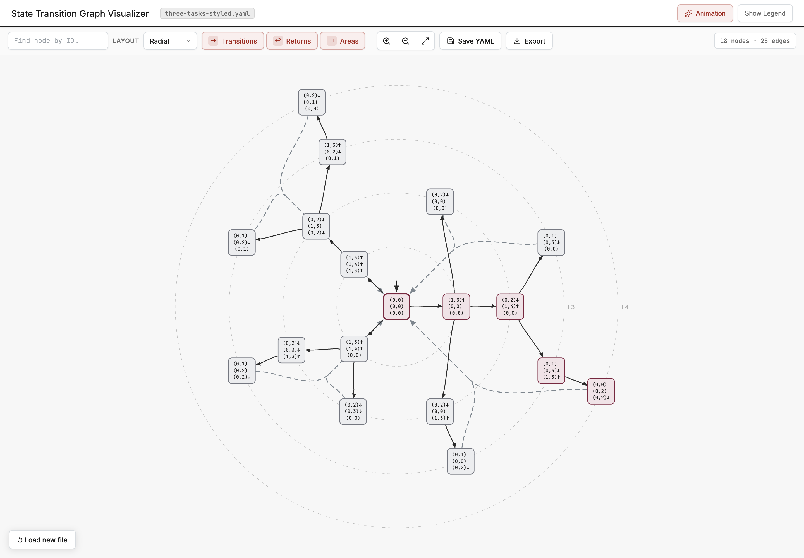
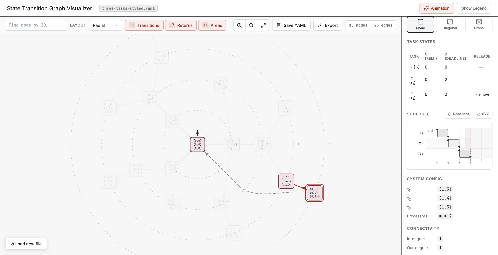
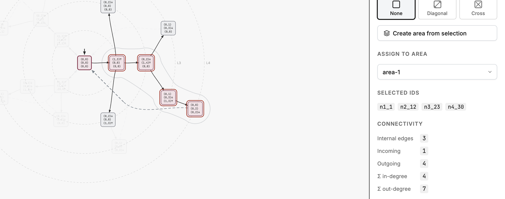

# State Graph Visualizer

[](https://state-graph-visualizer-alpha.vercel.app/)
[](https://github.com/peplxx/state-graph-visualizer/actions/workflows/ci.yml)

An interactive viewer for exploring state-transition graphs and schedules in real-time systems. It works alongside [libstgx](https://github.com/peplxx/libstgx/tree/main), a C++ library for building and validating these graphs: export a graph as YAML, then open it here to explore its states, connections, and schedules.



## Explore states and schedules

Switch between radial and tree layouts, zoom into a branch, or find a node by ID. Select a state to inspect its tasks, connections, and schedule along a path from the initial state. Toggle deadline markers and export the schedule as SVG.



## Analyze groups and create areas

Hold **Ctrl / Cmd** and click to add or remove nodes from a selection, or **Shift-drag** to select a group with the lasso. The sidebar shows selected IDs, internal edges, incoming and outgoing connections, and total node degrees.

Click **Create area from selection** to turn the group into a named visual region, or use **Assign to Area** to move it into an existing one. Customize its label, fill, border, and hatching; toggle its visibility or use **Select nodes** to inspect the group again.



## Import and export

Load YAML or JSON graphs. **Save YAML** preserves styling and areas for the next session; **Export** saves the graph as SVG. Try the [example shown above](examples/three-tasks-styled.yaml), browse more [examples](examples), or read the [YAML format documentation](docs/graph-format.md).

## Run locally

Requires Node.js 22 (22.12 or newer) and Bun 1.3.6.

```sh
bun install --frozen-lockfile
bun run dev
```

Open the URL printed in the terminal and drop a graph file into the window.

## Checks

```sh
bun run build      # TypeScript checks and production build
bun run lint       # Oxlint errors and warnings
bun run fmt:check  # Formatting check
```

GitHub Actions runs these checks on pushes and pull requests. Run `bun run fmt` to fix formatting locally; file exclusions are defined in `.oxfmtrc.json`.
