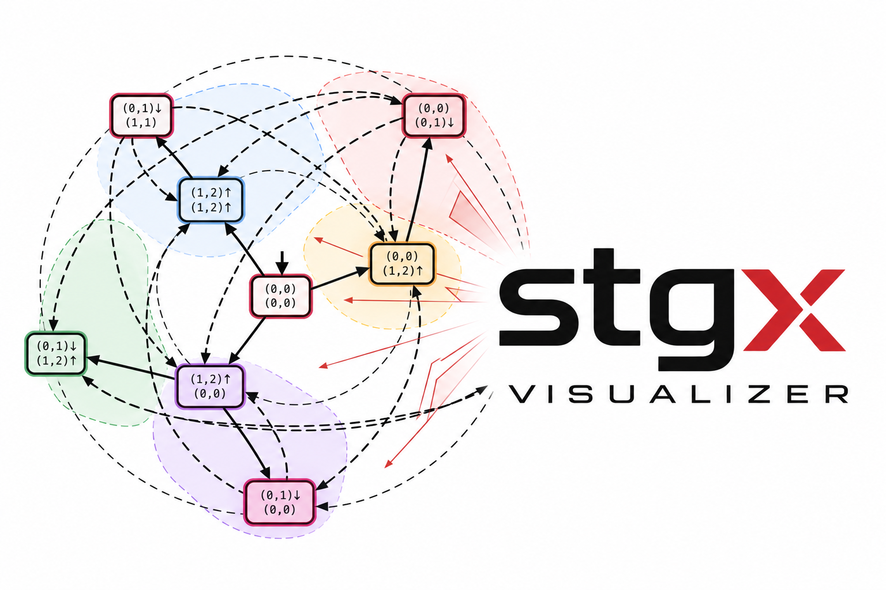
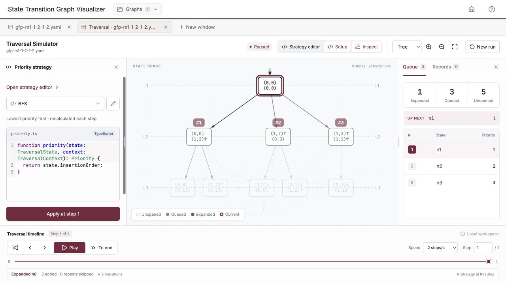

# State Graph Visualizer


[](https://state-graph-visualizer-alpha.vercel.app/)
[](https://github.com/peplxx/state-graph-visualizer/actions/workflows/ci.yml)

Explore state-transition graphs, inspect task schedules, and experiment with traversal strategies in your browser. Import a graph, open independent workspace tabs, and keep your graphs, strategies, and recordings locally between sessions.

The visualizer works alongside [libstgx](https://github.com/peplxx/libstgx/tree/main), a C++ library for building and validating graphs of real-time systems. Export a graph as YAML, then open it here to examine its states and compare exploration orders.

## Get started

1. Open the **[live demo](https://state-graph-visualizer-alpha.vercel.app/)** or [run locally](#run-locally).
2. Choose **Graphs → Upload graph** and load a YAML or JSON file. Try the small [nine-state example](examples/gfp-m1-1-2-1-2.yaml) from the [example library](examples).
3. Choose **New window → Explorer** to inspect the graph, or **New window → Traversal Simulator** to follow an exploration.

The **Help** button opens illustrated guides for Explorer, the simulator, and the priority function API. Help stays in one tab; use its contents to switch topics.

## Explore graphs and schedules

- Switch between **radial and tree layouts**, pan, zoom, fit the graph, or find a state by ID. Return arrows route around state cards and share common segments.
- Select a state to inspect its task values, incoming and outgoing connections, and schedule along a path from the initial state. Toggle deadline markers and export schedules as SVG.
- Use **Ctrl / Cmd + click** for multiple selection or **Shift + drag** for lasso selection. Inspect group connectivity and compare schedules.
- Turn a selection into a named **area**. Adjust node and area fills, borders, hatching, and labels; control their visibility through the view options.
- Resize side panels to leave more room for the graph or its details.


## Simulate a traversal

Choose a graph and a strategy, check the **Start nodes**, then press **Start traversal**. This evaluates the initial queue at step 0. **Next step** expands its first state, considers all outgoing transitions, and adds newly discovered states to the queue. Cycles and shared descendants never expand the same state twice.

The graph and queue show the same moment in the run: unopened nodes are faint, queued nodes carry position badges, and the current expanded node has a highlighted outline. Priorities are recalculated for the next expansion; smaller values go first.



Use **Play / Pause** and playback speed to watch the process, or **To end** to compute the remaining traversal without animating every step. The timeline lets you rewind, jump to a recorded step, and inspect added states or skipped repeats. Replaying recorded steps uses their saved priorities without executing the function again.

Applying changed code from an earlier step preserves the completed prefix and creates a new continuation. The previous branch is automatically saved as a separate recording, so you can compare both orders.

The simulator explores the supplied graph. It does not generate states or perform the pruning and schedulability analyses of the source algorithms. States unreachable from the selected starts remain unopened.

## Build a strategy library

Open **Strategy editor** from **New window → Traversal Simulator**, or directly from a simulator. Manage saved strategies and drafts on the left, and edit several functions in separate code tabs on the right. TypeScript highlighting, diagnostics, and **Ctrl + Space** field hints help you write priority functions.

The initial library contains six editable strategies:

| Strategy | Ordering rule |
| --- | --- |
| BFS | First discovered, first expanded: an ordinary FIFO queue. |
| Hybrid Slack 1 | Weighted active jobs and remaining work, combined with the largest deadline. |
| Hybrid Slack 2 | A weighted score with extra emphasis on work relative to deadlines. |
| Slack 1 | Sum of `1 − c/d`; a zero deadline contributes `1`. |
| Slack 2 | Total deadlines divided by total remaining work; states with no remaining work receive a very large priority. |
| Burmuakov 2022 | More unfinished jobs first, counting tasks with `c > 0`. |

A simple BFS strategy looks like this:

```ts
function priority(
  state: TraversalState,
  context: TraversalContext
): Priority {
  return state.insertionOrder;
}
```

Return a finite number or a nonempty tuple of finite numbers. Tuples compare left to right; equal priorities preserve insertion order. Keep the same result kind and tuple length throughout a run. Inputs are read-only, imports are not supported, and evaluation runs in a separate worker with a two-second timeout. A failed evaluation leaves the unfinished step uncommitted.

Save a strategy to reuse its code on any graph. Saving or editing a function does not change an existing run until you apply it. For field definitions and worked examples, open **Help → Priority function API**.

## Save your workspace

| Action | What it keeps |
| --- | --- |
| **Explorer → Save** | Commits graph edits to the local library. A dot on the tab marks unsaved edits. |
| **Download YAML** | Downloads the graph as a file without changing its saved status. |
| **Export** | Exports the graph as SVG. |
| **Strategy editor → Save** | Stores a named function in your strategy library. |
| **Inspect → Records → Save recording** | Keeps the run's graph snapshot, code versions, computed steps, and actual priorities. |

Drag workspace tabs to reorder them or double-click to rename. Closing an Explorer keeps its graph in the library. Saved strategies and recordings remain available after closing their windows; removing a graph from the library does not delete a recording's snapshot.

The workspace autosaves open tabs, simulator drafts, timeline positions, and view settings in this browser. Restored simulators are paused, and saved code is not executed automatically. Browser storage belongs to the current profile and site; clearing site data removes the workspace. Export graph files when you need a portable copy.

## Graph format and examples

See the **[YAML format documentation](docs/graph-format.md)** for states, transitions, task data, appearance, and areas. The **[example graphs](examples)** were generated with the [GFP tool in libstgx](https://github.com/peplxx/libstgx/tree/main/examples/gfp), using the parameters in each file with state pruning disabled.

## Run locally

Requires Node.js 22 (22.12 or newer) and Bun 1.3.6.

```sh
bun install --frozen-lockfile
bun run dev
```

Open the URL printed in the terminal. The application uses React, TypeScript, Vite, D3, and CodeMirror, with IndexedDB for the local workspace.

## Development checks

```sh
bun run build                     # TypeScript checks and production build
bun run test                      # Traversal, routing, strategies and workspace tests
bun run lint                      # Oxlint errors and warnings
bun run fmt:check                 # Formatting check
bun run schema:validate examples  # Validate example graphs
```

GitHub Actions runs these checks on pushes and pull requests. Use `bun run fmt` to format source files; exclusions are defined in `.oxfmtrc.json`.
